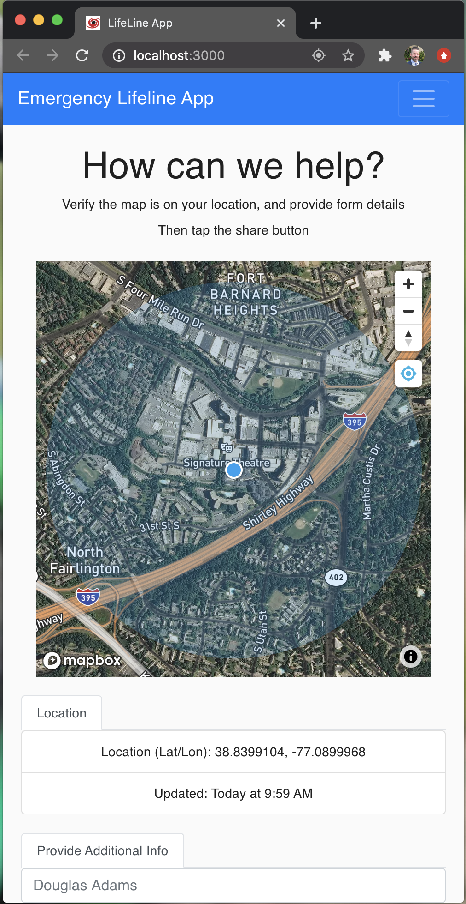

# Lifeline
This is the code for a mobile app to aid in emergency response. It allows a user to quickly get their exact location and share it. It also has native hooks to work with the full system of [erdemo.io](erdemo.io) and interact/share data with that system.

Here's what it looks like:




## Running the App
It's a React based webapp that's meant to be deployed as a PWA (progressive web app) - basically so it functions like a mobile app that doesn't need to be installed.

## How to run it?
You can run it just like you typically run a react app - webpack it and get it to the user's web browser. But if you want to run it on OpenShift (like we do), the instructions are below.

Use this for a quick and dirty way to get it running for development in your cluster:
```oc new-app nodeshift/ubi8-s2i-web-app:latest~https://github.com/RedHatGov/serverless-workshop-code.git#main --name=lifeline --context-dir=lifeline```

Production/serverless running instructions: TBD

### Running notes
* for geo-location to work you have to serve the app via https


## Dev/Test/Debug
### Develop with on OpenShift using odo
TBD

### Develop locally
This is just the standard Node.js/React model - use npm and yarn. [Full details here](./README-reactapp.md)

Clone this repo (optionally fork it first)
> `git clone https://github.com/redhatgov/serverless-workshop-code.git`

> `cd serverless-workshop-code/lifeline`

Install and run
> `yarn; yarn start`
